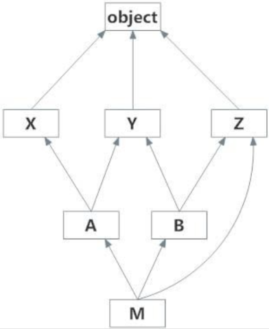
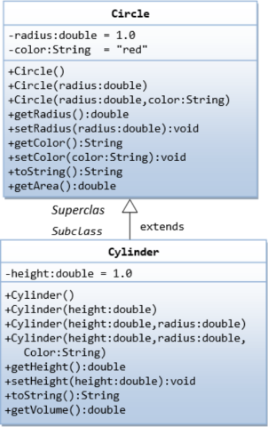

# No. 1
Implement the following to Python code using classes

# No. 2
Implement the following to Python code using classes

Create a driver file that utilizes all the methods for the Cylinder class and displays the changes made by them (e.g. After using setHeight(), you print out the height of the object)

Use the actual mathematical formula for the Area and Volume
---

Push the file to a GitHub repo (it can be where you store your code too) and send me the link to the specific file / repo through e-mail or Discord.
e-mail -> jason.wijadi@binus.ac.id

Due **this Saturday (11 Dec 2021) @19:00!**